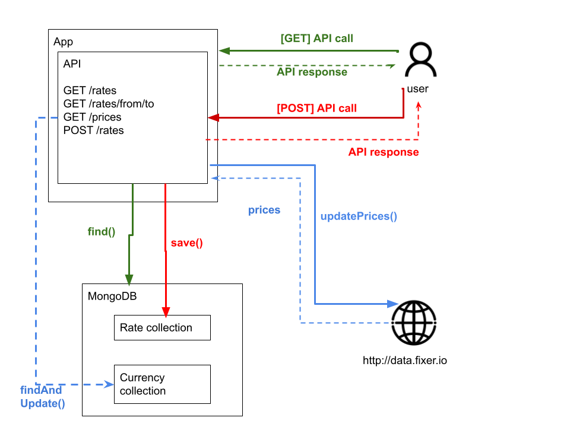

# Rates App
## _API provider for FX rates._  
  
Small app that allows a user to see a table of rates and create new ones by obtaining FX rates from an API.  
  
## High Level Design  
This app uses two MongoDB collections:
- Rates: Stores currency pairs created by user.
- Currency: Stores all available FX rates obtained from provided API. Currency base is EUR.  
  

  

## API Documentation
### GET /prices  
Description: Get all currency FX rates  
Response [200 OK]:  
```json
    [{
        "_id": "604e8d2402833a16dff7f635",
        "name": "AED",
        "updatedAt": "2021-03-15T00:37:24.417Z",
        "price": 4.388777,
        "__v": 0,
        "createdAt": "2021-03-14T22:24:36.515Z"
      },
      {
        "_id": "604e8d2402833a16dff7f636",
        "name": "AFN",
        "updatedAt": "2021-03-15T00:37:24.417Z",
        "price": 93.276043,
        "__v": 0,
        "createdAt": "2021-03-14T22:24:36.516Z"
      },
      {
        "_id": "604e8d2402833a16dff7f637",
        "name": "ALL",
        "updatedAt": "2021-03-15T00:37:24.417Z",
        "price": 123.075194,
        "__v": 0,
        "createdAt": "2021-03-14T22:24:36.516Z"
      }]
```    

### POST /rates  
Description: Creates new FX rate pair  
Body:  
```json
  {
      "from": "EUR",
      "to" : "USD", 
      "feePercentage": 10 
  }
```
Response [200 OK]:  
```json
  {
      "_id": "604e916586047d1a54c88e1f",
      "from": "EUR",
      "to": "USD",
      "feePercentage": 10,
      "__v": 0
  }
```

Take into account feePercentage is an optional data. So, new pair could be created without specified fee. For example...  
  
Body:  
```json
  {
      "from": "EUR",
      "to" : "BRL"
  }
```

Response [200 OK]:  
```json
{
    "_id": "604e918f86047d1a54c88e21",
    "from": "EUR",
    "to": "BRL",
    "__v": 0
}
```
  
Besides, _from_ and _to_ data should be currencies supported by API: [https://fixer.io/](https://fixer.io/)  
Please, let me share an example using not supported currencies...
  
Body:  
```json
  {
      "from": "AAA",
      "to" : "BRL"
  }
```
  
Response [500 Internal Server Error]  
```json
    "Invalid Data"
```
  
### GET /rates  
Description: Retrieves all created rates.  
Response [200 OK]  

```json
[
  {
    "Pair": "EUR-USD",
    "Original Rate": 1.195043,
    "Fee %": 10,
    "Fee Amount": 0.11950430000000001,
    "Rate with fee applied": 1.3145473
  },
  {
    "Pair": "EUR-BRL",
    "Original Rate": 6.596003,
    "Fee %": 0,
    "Fee Amount": 0,
    "Rate with fee applied": 6.596003
  }
]
```  

### GET /rates/_{from}_/_{to}_
Description: Query for a specific FX rate.  
Example: /rates/EUR/BRL  
Response [200 OK]

```json
{
    "Pair": "EUR-BRL",
    "Original Rate": 6.596003,
    "Fee %": 0,
    "Fee Amount": 0,
    "Rate with fee applied": 6.596003
}
``` 
